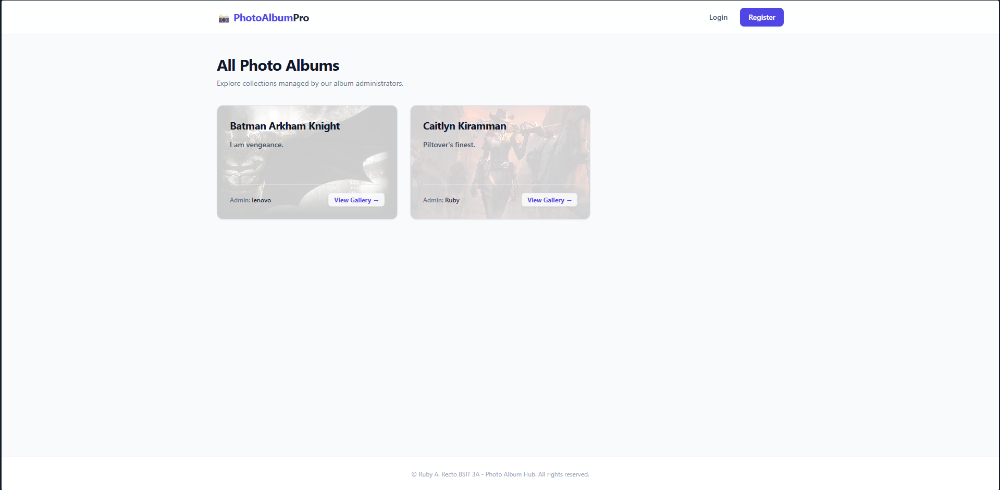
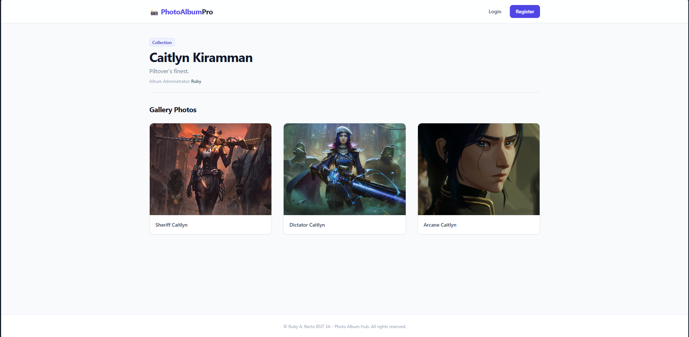
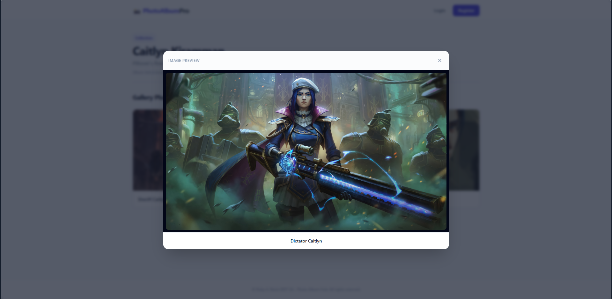

# 📸 Premium Photo Album Hub

A secure, scalable, enterprise-grade full-stack Photo Album web application built using the Django framework. This platform features a fully responsive user interface, dynamic relational data architecture, robust user authentication pipelines, and secure cloud-based media asset storage.

## 🚀 Live Application
- **Production URL:** [https://photo-album-4qvd.onrender.com](https://photo-album-4qvd.onrender.com)
- **Deployment Platform:** Render (Web Service + Managed Cloud PostgreSQL Engine)

---

## 🖼️ Application Layout & Interface Demo

### **Media Asset Gallery View**

### **Personalized Album Workspace**

### **Image Preview**

---

## 🛠️ Architecture & Technology Stack

The application employs a modern, decoupled cloud architecture designed to split server runtime computational processing from static file delivery and heavy binary object storage:

* **Core Backend Framework:** `Django (Python 3.14+)` - Drives the Model-View-Template (MVT) design patterns, security middleware filters, request/response routing pipelines, and object-relational database mapping (ORM).
* **Responsive Frontend Engine:** `Tailwind CSS` - Powering a dynamic utility-first user dashboard, custom form validation layouts, and real-time interface feedback cards.
* **Relational Production Database (The Brain):** `Managed PostgreSQL` - Dedicated cloud persistence database instance. Securely stores structured operational data: encrypted credentials, user relationships, album directories, and string references to remote content locators.
* **Blob Media Storage Object (The Vault):** `Cloudinary CDN` - High-performance, dedicated cloud asset delivery network. Functions as the external file object store for binary media blobs, completely isolating heavy photo file processing from the primary Render application server container.
* **Static Asset Compilation:** `WhiteNoise` - Native Python package integrated directly into Django's core WSGI pipeline to securely compress and serve layout stylesheets (CSS) and interactivity assets (JS) directly from memory cache.
